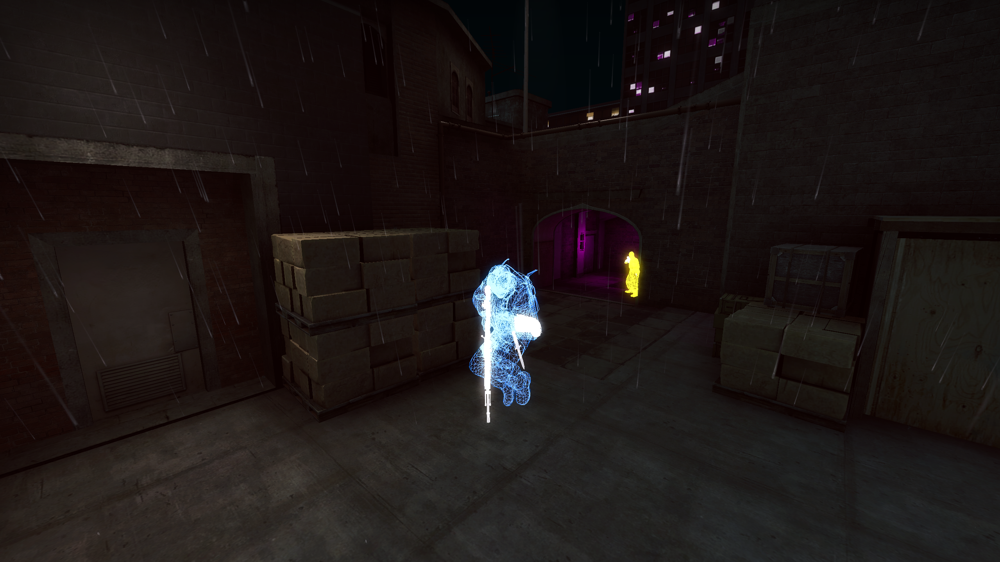

<h1 align="center">elysium</h1>

<p align="center"></p>

### installation

```bash
# in the directory of where you git clone'd this to

# build the client
$ cargo build --release

# copy the client into csgo's dir (dependencies resolve their paths from the location of the binary)
$ cp "${CARGO_TARGET_DIR:-target}/release/elysium" "${XDG_DATA_HOME:-${HOME}/.local/share}/Steam/steamapps/common/Counter-Strike Global Offensive/elysium"

# run the client
$ LD_LIBRARY_PATH="./bin/linux64" ./elysium -steam
```
